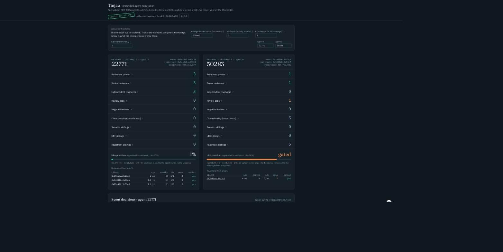

# Tinjau — reputation facts for AI agents, proven from Ethereum into Creditcoin



**Live:** https://k3cs.github.io/TinjauAI/ · **Contracts (Creditcoin CC3 Testnet, verified):** [`GroundedFacts`](https://creditcoin-testnet.blockscout.com/address/0x47212CE74EA4D6e300922AeB389A7b0a9D81Aabc) · [`AgentHireEscrow`](https://creditcoin-testnet.blockscout.com/address/0x153201A94E83AB5aA1C64f095375F2916EDA9F98) · [`CoverageBounty`](https://creditcoin-testnet.blockscout.com/address/0xBaAEAb3f635D39F6a9019745270Daf1812E0aE70) · BUIDL CTC 2026 Fall, track AI

## Problem
The ERC-8004 reputation registry on Ethereum mainnet is live and unusable raw. In the last 600 reviews, 346 of 367 agents have exactly one reviewer and one wallet wrote 225 reviews; 16 of 105 reviewers own agents themselves and wrote 59% of all feedback; in the last 60 days 83% of new registrations came from owners holding ten or more agents, 8,136 of them minted in batch transactions (RPC measurement, 29 Aug 2026; arXiv 2606.26028 finds 73.5% coordinated Sybil reviewers on Ethereum). The standard's own answer is "aggregate off-chain and trust the aggregator".

## Solution
Tinjau is a Creditcoin contract that admits **facts** about agents and their reviewers only through Attestcoin proofs of Ethereum transactions: which reviews are real, how long each reviewer had been active before reviewing, whether review indices have gaps, whether a reviewer owns agents, and how many agents share the same owner, registrant, URI or minting transaction. It computes no score; you pass your thresholds and get numbers anyone can recompute from the same proofs. An escrow turns the facts into a hiring premium, a bounty pays whoever brings evidence that changes a decision, and an autonomous scout decides what to prove.

## How it works
```mermaid
flowchart LR
  A[Ethereum mainnet / Sepolia<br/>ERC-8004 registries + any tx] -->|logs| S[GroundedScout<br/>targets · two-way evidence · timing]
  S -->|proof-by-tx| P[Attestcoin prover API]
  P -->|proof| G[GroundedFacts on Creditcoin<br/>verify precompile 0x…0FD2 → decode → facts]
  G --> E[AgentHireEscrow<br/>premium = f(facts, your thresholds)]
  G --> B[CoverageBounty<br/>pays evidence that changes a decision]
  G --> V[verify.ts / UI<br/>anyone recomputes the same facts]
```

## Run locally
```bash
git clone https://github.com/k3cs/TinjauAI && cd TinjauAI
forge test -vv                                   # 17 tests; real mainnet txBytes fixtures, precompile mocked
cd agent && npm i
npx tsx src/scout.ts --agents=22771 --minAge=500000 --minDepth=2 --k=3 --c=5      # dry-run: decisions + proofs
npx tsx src/verify.ts plans/agent-22771-*.json                                     # recompute facts off-chain
cd ../web && npm i && cp .env.example .env.local                                   # fill VITE_FACTS / VITE_ESCROW for live mode
npx vite build && npx vite preview                                                 # http://localhost:4173
```
Live run (needs tCTC): `PRIVATE_KEY=… npx tsx src/scout.ts --facts=0x47212CE7… --bounty=0xBaAEAb3f… --escrow=0x153201A9… --maxTargets=2 --hireWei=10000000000000000`. Deploy on Creditcoin uses `forge create --broadcast` (forge's simulation rejects Creditcoin headers), see `scripts/live-sequence.sh`.

## Contract addresses
| Chain | Contract | Address |
|---|---|---|
| Creditcoin CC3 Testnet (102031) | GroundedFacts | `0x47212CE74EA4D6e300922AeB389A7b0a9D81Aabc` |
| Creditcoin CC3 Testnet | AgentHireEscrow | `0x153201A94E83AB5aA1C64f095375F2916EDA9F98` |
| Creditcoin CC3 Testnet | CoverageBounty | `0xBaAEAb3f635D39F6a9019745270Daf1812E0aE70` |
| Ethereum mainnet (Attestcoin chainKey 3) | ERC-8004 Identity / Reputation (read via proofs) | `0x8004A169…a432` / `0x8004BAa1…9b63` |
| Ethereum Sepolia (chainKey 1) | ERC-8004 Identity / Reputation | `0x8004A818…BD9e` / `0x8004B663…8713` |

15 testnet transactions (18 proofs: 17 mainnet incl. a 2024 tx and a 52 KB batch-mint, 1 Sepolia), gas per tx and on-chain facts: `ATTESTCOIN_INTEGRATION.md`.

## What was built during the hackathon
All code in this repository was written during BUIDL CTC 2026 Fall (first commit 29 Aug 2026): three Solidity contracts (`src/`), the scout / verifier / exporter (`agent/src/`), the web UI (`web/`), tests and fixtures. Vendored, not written by us: `lib/usc/` (`EvmV1Decoder`, `INativeQueryVerifier` from `@gluwa/usc-contracts` 0.2.0) and `lib/forge-std`. The dynamic-premium formula reuses the pattern from the author's earlier Veritas (UHI9) work, without its insurance reserve.

## Known limitations
- Ethereum-side registries only (Attestcoin chainKey 1 and 3); Base has ~139× more registry activity and is out of reach today.
- The newest review nobody submitted is undetectable; only gaps below the highest proven `feedbackIndex` are. Bounties pay for higher indices.
- Clone density is a lower bound; aged wallets can be bought; legitimate multi-agent operators look like clone farms. Facts are reported, not judged.
- `facts()` iterates at most 256 reviewers per query (`truncated` flag beyond that).
- No consumer contract exists on Creditcoin today; the escrow is an example consumer. Attestcoin moves trust from RPC/indexers to Creditcoin's bonded attestor set; it does not remove it.

Docs: product `docs/01-produk.md`, technical `docs/02-teknis.md`, tracker `docs/03-task-tracker.md`, evaluation dossier with verification commands `docs/evaluation-dossier.md`, deck `docs/deck.pdf`, demo script `docs/demo-script.md`. License: MIT.
